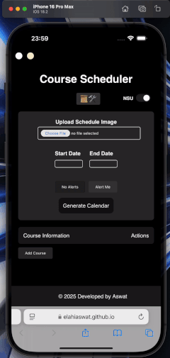

# Course-Scheduler
Course Scheduler: A web application to upload an image and schedule courses. Generate calendar events with alerts. Built with HTML, CSS, JavaScript, and Tesseract.js.

  

## Overview

Course Scheduler is a web application that allows users to upload an image of their course schedule, parse the text using OCR (Optical Character Recognition), and generate calendar events. The application supports setting alerts for events and exporting the schedule as an ICS file compatible with most calendar applications.

## Features

- **Upload Schedule Image**: Upload an image of your course schedule.
- **Text Recognition**: Parse text from the uploaded image using Tesseract.js.
- **Course Management**: Add, edit, and delete courses manually.
- **Generate Calendar**: Export the schedule as an ICS file.
- **Alerts**: Set alerts for events to get notified in advance.

## Technologies Used

- **HTML**: Structure of the web application.
- **CSS**: Styling of the web application.
- **JavaScript**: Functionality and interactivity.
- **Tesseract.js**: OCR library for text recognition from images.

## Getting Started

### Prerequisites

- A modern web browser (Chrome, Firefox, Safari, Edge)

### WebApp

[Open App➚](https://elahiaswat.github.io/Course-Scheduler/)

## Usage

1. **Upload an Image**: Click on the "Upload Schedule Image" button and select an image file.
2. **Set Dates**: Choose the start and end dates for the schedule.
3. **Set Priority**: Choose whether you want alerts for the events.
4. **Generate Calendar**: Click on the "Generate Calendar" button to download the ICS file.

## Contributing

Contributions are welcome! Please fork the repository and create a pull request with your changes.

## License

This project is licensed under the MIT License. See the [LICENSE](LICENSE) file for details.

## Contact

For any inquiries or feedback, please contact [aswat.mohammed@northsouth.edu](mailto:aswat.mohammed@northsouth.edu).

## Acknowledgements

- [Tesseract.js](https://github.com/naptha/tesseract.js) for the OCR functionality.

---

© 2024 Developed by Aswat
